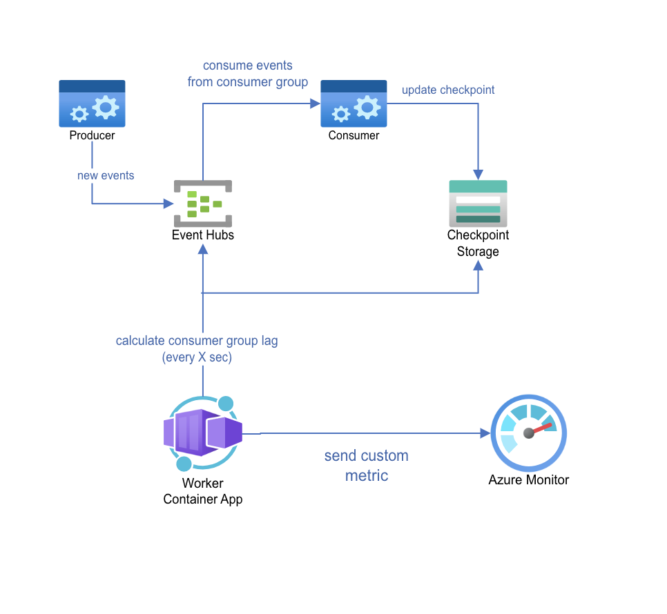
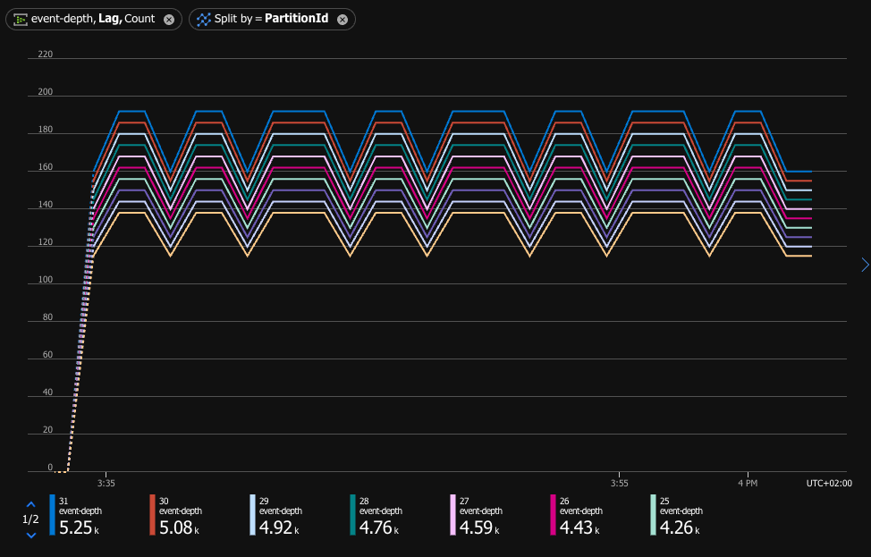

# eventhub-custom-metrics-emitter

This sample project show how to implement sending a custom metric events to Azure Event Hub. Specifically, we will calculate the unprocessed events (The Lag) of specific consumer group in event hub. More about custom metrics in Azure Monitor check [this article](https://learn.microsoft.com/en-us/azure/azure-monitor/essentials/metrics-custom-overview)


## Table of Contents
- [Custom-Metrics-Emitter](#custom-metrics-emitter)
  - [Table of Contents](#table-of-contents)
  - [Overview](#overview)
  - [High-Level Solution Concept](#high-level-solution-concept)
    - [Custom Metric](#custom-metric)
  - [Step by step deployment](#step-by-step-deployment)
    - [Pre-requisite](#pre-requisite)
    - [Deploying the solution](#deploying-the-solution)
      - [Configuring Bicep to deploy the solution](#configuring-bicep-to-deploy-the-solution)
  - [Test Locally](#test-locally)

## Overview

When using Azure Event Hub, it is important to monitor the lag of the consumer group. This is the number of events that have been sent to the event hub but have not yet been processed by the consumer group. This is important to monitor as it can indicate if the consuming applications are able to address the load of the event hub. If the lag is increasing, it may indicate that the consuming applications are not able to keep up with the load of the event hub.

> This metric is not available in event hub standard metrics for now.


## High-Level Solution Concept



The solution will create the required resources and deploy the solution on Azure Container App. The solution will run as a Azure Container App and will send a custom metric to Azure Monitor. The custom metric will include the following dimensions:

- Eventhub name (the topic)

- Consumer group name

- Partition ID

The resources that will be created are:

- Azure Contianer App Environment - this is the environment which will host the solution

- Azure Container App - this is the container which will run the solution

- Managed Identity - this is the identity which will be used by the container app to authenticate to Azure Event Hub and Azure Storage

- Role assignments - these are the role assignments which will be assigned to the managed identity to allow it to read the checkpoints from Azure Storage and send the custom metric to Azure Monitor

### Custom Metric

Example of json schema which send a custom metric can be found [here](test/custom1.json)
As the schema also include the partition number as one of the dimensions - we can have a view of unprocessed events per partition:



## Step by step deployment 

This solution is aimed for customers/users who already have an Azure Event Hub and want to monitor the lag of a specific consumer group. Please follow the pre-requisites below before deploying the solution. The users running the solution will need to have the Contributor role on the resource group where the solution is deployed. (at least)

The image for this solution was build using GitHub Action. The code is [here](.github/workflows/ghcr_build_push.yml), it leverages the ghcr as the container registry. The image is available ```docker pull ghcr.io/yodobrin/custom-metrics-emitter:latest``` 

### Pre-requisite
1. Deploy the following Azure services:
   1.  Azure Event Hub
   2.  Azure Storage
   3.  Azure Application Insights (optional)
2. Producer and Consumer sample application for Azure Event hub [code example](https://learn.microsoft.com/en-us/azure/event-hubs/event-hubs-dotnet-standard-getstarted-send?tabs=passwordless%2Croles-azure-portal)

### Deploying the solution

1. Clone this repository to a local directory

2. Navigate to the directory where the repository was cloned, and to deploy/bicep folder

3. Modify the params.json file to include the required parameters for the deployment (see below for more details)

4. Run the following command to deploy the solution:

```azcli
az deployment group create --resource-group <resource group name> --template-file main.bicep --parameters @param.json
```

5. Once completed successfully, the solution will be deployed and running.


#### Configuring Bicep to deploy the solution

The solution can be deployed using Bicep, the following files are included:

- `main.bicep` - main bicep file which deploy the solution

- `parameters.json` - parameters file which include the required parameters for the deployment

- `aca.bicep` - bicep file which deploy the Azure Container App

- `roles.bicep` - bicep file which deploy the required roles for the solution

The following parameters should be set, these are subset of the environment variables which need to be set when running the docker image. The other items are either derived or created during the deployment process.

- `EventHubNamespace` - This is the namespace of your eventhub

- `EventHubName` - This is the name of your eventhub you wish to monitor within the namespace

- `CheckpointAccountName` - This is the name of the storage account where the checkpoints are stored

- `CheckpointContainerName` - This is the name of the container within the storage account where the checkpoints are stored

- `CustomMetricInterval` - an optional value, this is the interval in milliseconds between each metric being sent to Azure Monitor. 

- `managedIdentityName` - As part of the deployment, a user assigned managed identity will be created. This is the name of that identity. It will be used as the identity for the container app. This identity will be granted the required roles for the solution to work. These are the roles:

  - `Monitoring Metrics Publisher` role for Azure Event Hub

  - `Azure Event Hubs Data Owner` role for Azure Event Hub

  - `Storage Blob Data Reader` for Azure Storage

## Redploying to other image tag

When you need to update to latest or specific version of the image, you can use the following approach:

1. Modify the `param_redeploy.json` file to include the required parameters for the deployment (Use the existing values from your resource group)

2. Run the following command to redeploy the solution:

```azcli
az deployment group create --resource-group  <resource group name> --template-file redeploy.bicep --parameters @param_redeploy.json
```

## Test Locally
In order to run and test locally the solution, build a docker image (using this [Dockerfile](custom-metrics-emitter/Dockerfile)) and execute the following run command - fill the missing values: 

`docker run -d -e EventHubNamespace="" -e Region="" -e SubscriptionId="" -e ResourceGroup="" -e TenantId=""  -e EventHubName="" -e ConsumerGroup="optional" -e CheckpointAccountName="" -e CheckpointContainerName="" -e CustomMetricInterval="" -e ManagedIdentityClientId="optional" -e APPLICATIONINSIGHTS_CONNECTION_STRING="optional" -e AZURE_TENANT_ID="optional" -e AZURE_CLIENT_ID="optional" -e AZURE_CLIENT_SECRET="optional"  <dockerimagename>`

remark: ConsumerGroup environment variable - if `empty` then - geting all consumer group of given EventHub, else: can add specific consumer group names seprated by `;`